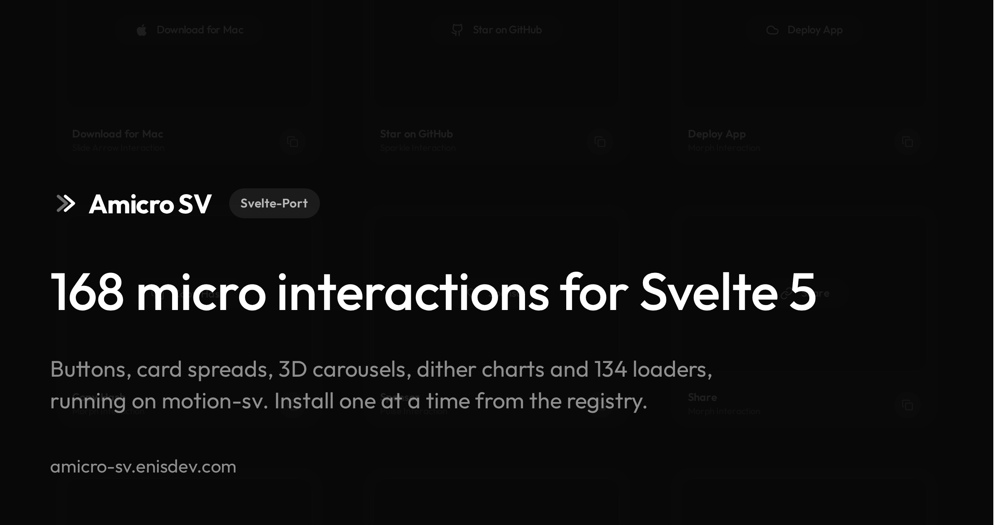

<div align="center">

# Amicro SV

[](https://amicro-sv.enisdev.com)


**168 micro interactions for Svelte 5**, published as 179 shadcn style registry items and pulled into your project one file at a time.

[Demo](https://amicro-sv.enisdev.com) · [Install page](https://amicro-sv.enisdev.com/install) · [llms.txt](https://amicro-sv.enisdev.com/llms.txt)

</div>

> [!NOTE]
> Port of the React library [Amicro](https://github.com/Subhan-code/Amicro--Micro-transitions-) by [Syed Subhan](https://x.com/SubhanHQ). He designed every interaction, this repo rebuilds them on Svelte 5 and [motion-sv](https://github.com/hanielu/motion-svelte). Provenance and license: [NOTICE.md](NOTICE.md).

motion-sv is the best Motion port for Svelte I know of, and this site is the stress test: 168 components that exist in React, rebuilt to show what carries over and where Svelte and React actually diverge. 157 live in `src/lib/amicro/`, the 11 dither charts in `src/lib/app/components/simple-comp/`.

## Install

Requires SvelteKit and Tailwind 4. `shadcn-svelte init` does not install Tailwind, it exits when
Tailwind is missing, so add it first.

```
╭──────────────────────────────────────── amicro-sv registry ────────────────────────────────────────╮
│ npx sv add tailwindcss                                                      add Tailwind 4         │
│ npx shadcn-svelte@latest init                                               set up components.json │
│ npx shadcn-svelte@latest add https://amicro-sv.enisdev.com/r/fade-in.json   add a component        │
╰────────────────────────────────────────────────────────────────────────────────────────────────────╯
```

The CLI writes the component into your `ui` alias under `amicro/`, installs `motion-sv` and drops
the upstream MIT license next to it. Every name from the [install page](https://amicro-sv.enisdev.com/install) works,
or from [llms.txt](https://amicro-sv.enisdev.com/llms.txt) if a coding agent is doing the picking.

## Development

```bash
pnpm install
pnpm dev
pnpm check
pnpm build
pnpm test:amicro      # Playwright motion check, needs pnpm dev running
pnpm registry:build   # regenerate registry.json, static/r and llms.txt
```

## Conventions

[PORTING.md](PORTING.md) is the contract for every ported file. Where motion-sv and Motion for React differ, and which of those differences fail silently: [docs/motion-sv.md](docs/motion-sv.md), [NOTICE.md](NOTICE.md) and the agent skill in [.claude/skills/motion-sv](.claude/skills/motion-sv/SKILL.md).

## License

MIT, inherited from the original. Provenance: [NOTICE.md](NOTICE.md), [LICENSE.upstream](LICENSE.upstream).
